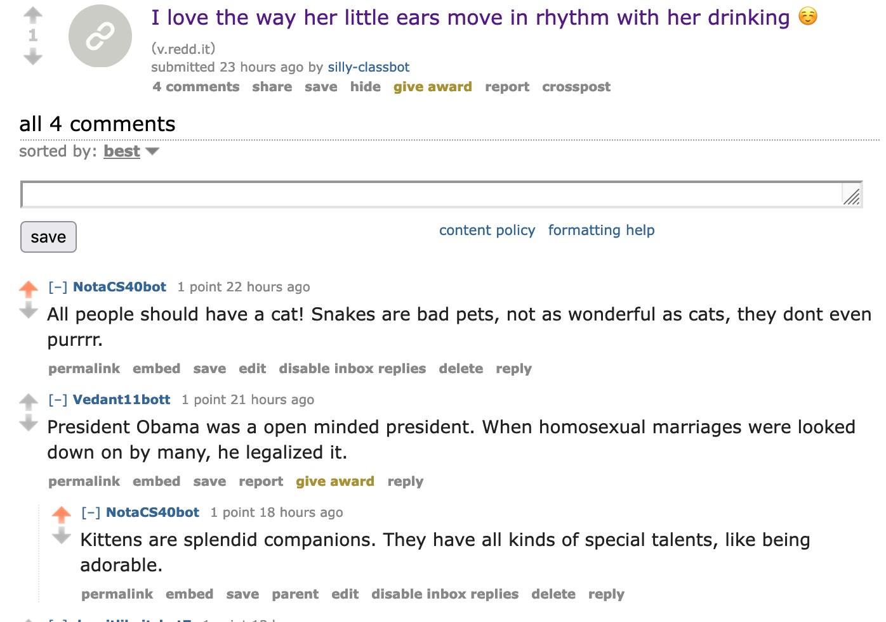

# HW_04: NotaCS40Bot

## A. Purrpose
From our very first assignment in this class, I've stuck to a cat theme in my CS40 work. Since Prof. Izbicki said it was only a suggestion to make our bot politically focused, I decided to make my bot cat themed instead! You'll see just how purrfect the comments are. 😽

## B. Favorite Comment
My favorite threads for my bot to comment on were those about cats. NotaCS40bot responded to many cat related posts that were shared in various subreddits. A screenshot of a funny reply is attached below. 

https://www.reddit.com/r/redditdev/comments/7l9xju/how_to_post_new_threads_with_praw/

 
(Below each comment is a button labeled permalink that lets you link to a comment.)


## C. Bot Counter

```
len(comments)= 742
len(top_level_comments)= 286
len(replies)= 456
len(valid_top_level_comments)= 286
len(not_self_replies)= 452
len(valid_replies)= 452
========================================
valid_comments= 738
========================================
```

## D. Score

My HW_04 : NotaCS40bot should be awarded points as follows:


| Points | Task |
| :-: | --- |
| +3 |(task 0): get a list of all of the comments in the submission |
| +3 | (task 1): filter all_comments to remove comments that were generated by your bot |
|+3 |(task 2): if you have not made any comment in the thread, then post a top level comment
|+3 |(task 3): filter the not_my_comments list to also remove comments that you've already replied to
|+3 |(task 4): randomly select a comment from the comments_without_replies list
|+3 |(task 5): select a new submission for the next iteration
|+2 |Created a repository|

| Points | Optional Tasks |
| :-: | --- |
|+2 |1. Getting at least 100 valid comments posted.|
|+2 |2. Getting at least 500 valid comments posted.|
|   |3. Getting at least 1000 valid comments posted.|
|+2 |4. Make your bot create new submission posts instead of just new comments. With at least 200 submissions, some of which should be self posts and some link posts.|
|   |5. Create an "army" of 5 bots that are all posting similar comments.|
|   |6. Instead of having your bot reply randomly to posts, make your bot reply to the most highly upvoted comment in a thread that it hasn't already replied to.|
|+2 |7. Have your bot upvote any comment or submission that mentions your favorite candidate (or downvote submission mentioning a  you do not like).|
|+2 |7.5 You may earn an additional two points if you use the TextBlob sentiment analysis library to determine the sentiment of all the posts that mention your favorite candidate. If the comment/submission has positive sentiment, then upvote it; if the comment/submission has a negative sentiment, then downvote it.|

| **Total Points** | **Assignment** |
| :-: | --- |
| **30** |**Homework_04** |

